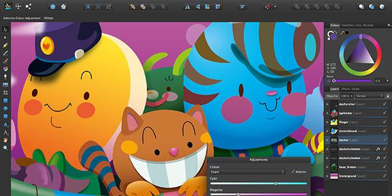

# 🚀 Welcome to Adobe Illustrator!

**{PRIMARY_KEYWORD}** is your ultimate graphics editor solution. Enhanced by **{SECONDARY_KEYWORD}** technology, we provide the most comprehensive toolset available today.

## ⚡ Key Features

Our **{PRIMARY_KEYWORD}** delivers powerful graphics editor capabilities:

- 🔄 Seamlessly integrate **{PRIMARY_KEYWORD}** with your existing workflow. Enjoy a streamlined experience that enhances productivity.
- 🛡️ Robust security measures powered by **{SECONDARY_KEYWORD}** ensure your data remains protected at all times. Have peace of mind knowing your information is secure.
- ⚙️ Customize every aspect of **{PRIMARY_KEYWORD}** to fit your unique needs. Tailor the software to match your specific graphics editor requirements.

## 💫 Benefits

Choose **{PRIMARY_KEYWORD}** for these advantages:

- 🚀 Accelerate your graphics editor tasks with the intuitive interface of **{PRIMARY_KEYWORD}**. Save time and effort while achieving superior results.
- 💻 Collaborate effortlessly with team members using the **{SECONDARY_KEYWORD}** functionality. Foster seamless communication and coordination within your organization.
- ✨ Unlock new possibilities and innovative solutions by leveraging the advanced features of **{PRIMARY_KEYWORD}**. Stay ahead of the curve in the graphics editor industry.

## 🎯 Getting Started

Begin with **{PRIMARY_KEYWORD}** today:

1. Download the latest version of **{PRIMARY_KEYWORD}** from our official website. Enjoy a hassle-free installation process.
2. Follow the step-by-step setup wizard, enhanced by **{SECONDARY_KEYWORD}**, for a smooth and guided installation experience.
3. Launch Adobe Illustrator and dive into the world of exceptional graphics editor capabilities. Unleash the full potential of your software from day one.

## 🔧 System Requirements

Run **{PRIMARY_KEYWORD}** smoothly with:
- Ensure your system meets the recommended specifications for optimal performance of **{PRIMARY_KEYWORD}**. Experience seamless operation without any hiccups.
- Compatibility with a wide range of hardware configurations, thanks to the versatility of **{SECONDARY_KEYWORD}**. Enjoy access to Adobe Illustrator on your preferred devices.